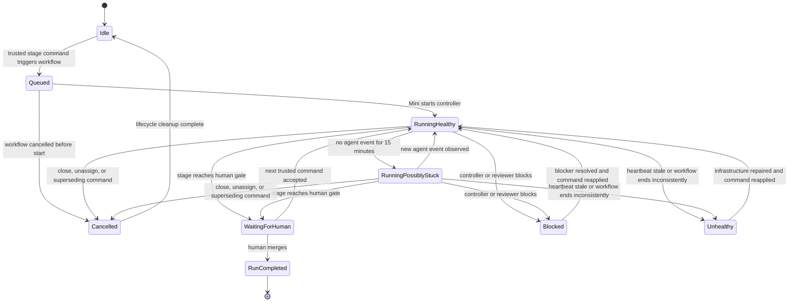

# AI Engineer State Machine

This document is the behavioral contract for the repository's AI engineer.
Controller changes must preserve it or update it in the same pull request.

## Invariants

1. Assignment gives the AI ownership; it starts intake only.
2. Comments provide instructions but never start work.
3. A human command label starts exactly one stage.
4. Before a PR exists, commands and discussion live on the issue.
5. After a PR exists, commands and discussion live on that PR.
6. Only `carlospche` may assign or authorize a stage transition.
7. The AI never merges.
8. There may be at most one open AI PR per issue.
9. Persona prompts are loaded from the protected default branch.
10. A stage publishes only after rechecking that the issue is open, the PR is
    open when applicable, and the AI remains assigned.
11. Accepted artifacts and stage metadata are duplicated in one collapsed,
    bot-owned PR state comment, so ordinary PR-description edits cannot erase
    controller state.
12. Every active stage owns one visible, bot-authored live-status comment.
    Status metadata is not treated as human feedback.

## States

| State | Surface | Meaning |
|---|---|---|
| `Unclaimed` | Issue | Issue is open and the AI is not assigned. |
| `IntakeRunning` | Issue | Intake Analyst is triaging the issue. |
| `AwaitingRoute` | Issue | Intake is ready; no substantive work runs until a route is selected. |
| `DebuggingIssue` | Issue | Investigator, Test Engineer, and Debug Reviewer are establishing root cause. |
| `DebugReadyIssue` | Issue | Diagnosis is ready; the human selects further debugging, architecture, or fix planning. |
| `ArchitectureLoop` | PR | Architect, Test Engineer, and Architecture Reviewer are iterating. |
| `ArchitectureReady` | PR | Architecture is ready for human review. |
| `DebuggingPR` | PR | Existing PR has returned to diagnosis. |
| `DebugReadyPR` | PR | Diagnosis is ready on the PR. |
| `PlanLoop` | PR | Plan Builder, Test Engineer, and Plan Reviewer are iterating. |
| `PlanReady` | PR | Plan and test plan are ready for human approval. |
| `ImplementationLoop` | PR | Test Engineer, Implementor, and Implementation Reviewer are iterating. |
| `ImplementationReady` | PR | Reviewed implementation is ready for human review and merge. |
| `NeedsHuman` | Current surface | Personas cannot converge or require a human decision. |
| `Suspended` | PR or issue | AI was unassigned; existing work is frozen. |
| `AttemptAbandoned` | Closed PR | PR was closed without merge; the issue remains open and AI is unassigned. |
| `IssueCancelled` | Closed issue | Issue closure cancels the open AI attempt. |
| `Completed` | Merged PR | Human merged the implementation; AI ownership ends. |
| `HumanOverride` | Merged design PR | Human merged before implementation; AI ownership ends and the issue remains open unless closed manually. |

## Operational-health overlay

The lifecycle state above and run health are orthogonal. For example,
`PlanLoop` can be `RunningHealthy` or `RunningPossiblyStuck`.

| Health state | Visible indication | Meaning |
|---|---|---|
| `Idle` | No `ai-running` label | No autonomous stage owns the item. |
| `Queued` | Actions run only | GitHub accepted the event, but the Mini has not started the job and therefore cannot yet edit the issue or PR. |
| `RunningHealthy` | `ai-running`; green status | Controller heartbeat and OpenHands event activity are recent. |
| `RunningPossiblyStuck` | `ai-running`; yellow status | Controller monitor is alive, but no new OpenHands event has appeared for 15 minutes. |
| `WaitingForHuman` | Paused status | Stage reached a human gate and owns no compute. |
| `Blocked` | `ai-needs-human`; red status | Controller reported a blocker or convergence failure. |
| `Unhealthy` | `ai-needs-human`; red status | Watchdog found a stale heartbeat or a workflow that ended without a terminal status update. |
| `Cancelled` | Grey status | Ownership, closure, or a newer command cancelled the run. |
| `RunCompleted` | Green completed status | A terminal lifecycle event, normally human merge, completed the attempt. |



### Status publication

- Intake, issue-side debugging/design, and pre-PR planning publish status on
  the issue.
- Once the controller creates a PR, it closes the issue status as moved and
  continues the same run in a status comment on the PR.
- The comment exposes stage, persona, review round, current activity,
  controller heartbeat and its five-minute validity deadline, last observed
  OpenHands event, stage deadline, and a direct Actions-run link.
- The controller refreshes its heartbeat every 60 seconds. A new OpenHands
  event refreshes agent activity. No agent event for 15 minutes changes only
  the display to `RunningPossiblyStuck`; it does not cancel legitimate long
  model or tool work.
- Success, cancellation, suspension, merge, PR closure, issue closure, and
  failures publish an explicit non-running outcome and remove `ai-running`.

The reconciliation workflow runs every five minutes on the Mac Mini. With one
self-hosted runner, it cannot execute concurrently with the engineer job; it
runs once the runner is free and reconciles any stale `ai-running` status
against the authoritative Actions run. If the Mini is offline, the frozen
heartbeat is the visible signal; automatic reconciliation occurs after the
Mini and runner return. Moving the watchdog to `ubuntu-latest` or a second
runner later makes external failure detection immediate without changing the
controller protocol.

There is one unavoidable Mini-only blind spot: before the Mini starts a newly
queued job, it cannot create the first issue/PR status comment. During
`Queued`, the Actions run is authoritative. A GitHub-hosted announcer would be
required to put that pre-start state directly on the issue or PR.

## State diagram

```mermaid
stateDiagram-v2
    [*] --> Unclaimed
    Unclaimed --> IntakeRunning: trusted human assigns AI
    IntakeRunning --> AwaitingRoute: intake report ready
    IntakeRunning --> NeedsHuman: intake blocked

    AwaitingRoute --> IntakeRunning: issue ai-intake
    AwaitingRoute --> DebuggingIssue: issue ai-debug
    AwaitingRoute --> ArchitectureLoop: issue ai-architecture
    AwaitingRoute --> PlanLoop: issue ai-plan

    DebuggingIssue --> DebugReadyIssue: investigator and reviewers agree
    DebuggingIssue --> NeedsHuman: diagnosis cannot converge
    DebugReadyIssue --> DebuggingIssue: issue ai-debug
    DebugReadyIssue --> ArchitectureLoop: issue ai-architecture
    DebugReadyIssue --> PlanLoop: issue ai-plan

    ArchitectureLoop --> ArchitectureReady: architecture reviewers agree
    ArchitectureLoop --> NeedsHuman: architecture cannot converge
    ArchitectureReady --> ArchitectureLoop: PR ai-architecture
    ArchitectureReady --> DebuggingPR: PR ai-debug
    ArchitectureReady --> PlanLoop: PR ai-plan

    DebuggingPR --> DebugReadyPR: investigator and reviewers agree
    DebuggingPR --> NeedsHuman: diagnosis cannot converge
    DebugReadyPR --> DebuggingPR: PR ai-debug
    DebugReadyPR --> ArchitectureLoop: PR ai-architecture
    DebugReadyPR --> PlanLoop: PR ai-plan

    PlanLoop --> PlanReady: plan reviewers agree
    PlanLoop --> NeedsHuman: plan cannot converge
    PlanReady --> PlanLoop: PR ai-plan
    PlanReady --> ArchitectureLoop: PR ai-architecture
    PlanReady --> DebuggingPR: PR ai-debug
    PlanReady --> ImplementationLoop: PR ai-implement

    ImplementationLoop --> ImplementationReady: code and tests approved
    ImplementationLoop --> NeedsHuman: implementation cannot converge
    ImplementationReady --> ImplementationLoop: PR ai-implement
    ImplementationReady --> PlanLoop: PR ai-plan
    ImplementationReady --> ArchitectureLoop: PR ai-architecture
    ImplementationReady --> DebuggingPR: PR ai-debug
    ImplementationReady --> Completed: human merges
    ArchitectureReady --> HumanOverride: human merges design PR
    DebugReadyPR --> HumanOverride: human merges diagnosis PR
    PlanReady --> HumanOverride: human merges plan PR
    ArchitectureLoop --> HumanOverride: human merges during design
    DebuggingPR --> HumanOverride: human merges during diagnosis
    PlanLoop --> HumanOverride: human merges during planning
    ImplementationLoop --> HumanOverride: human merges during implementation
    NeedsHuman --> HumanOverride: human merges blocked PR
    Suspended --> HumanOverride: human merges frozen PR

    NeedsHuman --> DebuggingIssue: issue ai-debug before PR
    NeedsHuman --> IntakeRunning: issue ai-intake before PR
    NeedsHuman --> DebuggingPR: PR ai-debug
    NeedsHuman --> ArchitectureLoop: ai-architecture
    NeedsHuman --> PlanLoop: ai-plan
    NeedsHuman --> ImplementationLoop: PR ai-implement

    IntakeRunning --> Suspended: AI unassigned
    AwaitingRoute --> Suspended: AI unassigned
    DebuggingIssue --> Suspended: AI unassigned
    ArchitectureLoop --> Suspended: AI unassigned
    DebuggingPR --> Suspended: AI unassigned
    PlanLoop --> Suspended: AI unassigned
    ImplementationLoop --> Suspended: AI unassigned
    ArchitectureReady --> Suspended: AI unassigned
    DebugReadyPR --> Suspended: AI unassigned
    PlanReady --> Suspended: AI unassigned
    ImplementationReady --> Suspended: AI unassigned
    NeedsHuman --> Suspended: AI unassigned

    Suspended --> IntakeRunning: reassign with no open PR
    Suspended --> ArchitectureLoop: reassign then PR ai-architecture
    Suspended --> DebuggingPR: reassign then PR ai-debug
    Suspended --> PlanLoop: reassign then PR ai-plan
    Suspended --> ImplementationLoop: reassign then PR ai-implement

    ArchitectureReady --> AttemptAbandoned: close PR unmerged
    DebugReadyPR --> AttemptAbandoned: close PR unmerged
    PlanReady --> AttemptAbandoned: close PR unmerged
    ImplementationReady --> AttemptAbandoned: close PR unmerged
    NeedsHuman --> AttemptAbandoned: close PR unmerged
    ArchitectureLoop --> AttemptAbandoned: close PR unmerged
    DebuggingPR --> AttemptAbandoned: close PR unmerged
    PlanLoop --> AttemptAbandoned: close PR unmerged
    ImplementationLoop --> AttemptAbandoned: close PR unmerged
    Suspended --> AttemptAbandoned: close PR unmerged

    Unclaimed --> IssueCancelled: close issue
    IntakeRunning --> IssueCancelled: close issue
    AwaitingRoute --> IssueCancelled: close issue
    DebuggingIssue --> IssueCancelled: close issue
    ArchitectureLoop --> IssueCancelled: close issue
    DebuggingPR --> IssueCancelled: close issue
    PlanLoop --> IssueCancelled: close issue
    ImplementationLoop --> IssueCancelled: close issue
    ArchitectureReady --> IssueCancelled: close issue
    DebugReadyPR --> IssueCancelled: close issue
    PlanReady --> IssueCancelled: close issue
    ImplementationReady --> IssueCancelled: close issue
    NeedsHuman --> IssueCancelled: close issue
    Suspended --> IssueCancelled: close issue
```



## Commands

| Command | Valid surface | Effect |
|---|---|---|
| `ai-intake` | Issue before PR | Repeat intake after new issue information. |
| `ai-debug` | Issue before PR, or active AI PR | Establish or revise diagnosis. |
| `ai-architecture` | Issue before PR, or active AI PR | Enter or return to high-level architecture. |
| `ai-plan` | Issue before PR, or active AI PR | Enter or return to detailed planning. A diagnosis selects the specialized Fix Plan Builder. |
| `ai-implement` | Active AI PR with an accepted plan | Start test-first implementation or revise existing implementation. |
| `ai-intake-ready` | Status only | Intake recommendation is available. |
| `ai-running` | Status only | A controller stage currently owns the issue or PR. |
| `ai-needs-human` | Status only | Autonomous work stopped for a decision or blocker. |

Command labels are removed when accepted. Reapplying a label requests another
pass. If several command labels are present simultaneously, the controller
removes all of them, performs no transition, applies `ai-needs-human`, and asks
the human to select exactly one.

A newer command applied by the trusted human while a stage is running
supersedes that stage. The old run publishes nothing; repository-wide
concurrency then runs the newer command.

Workflow redelivery is idempotent: consumed command events become no-ops,
completed intake is not repeated while `ai-intake-ready` remains, and
ownership/closure/reopening notices update one marked bot comment rather than
accumulating duplicates.

## Issue events

| Current condition | Event | Behavior |
|---|---|---|
| No open AI PR | Trusted human assigns AI | Run intake and wait for a route. |
| Open AI PR exists | Trusted human reassigns AI | Restore ownership, link the PR, and wait for a PR command. |
| Untrusted actor assigns AI | Assignment | Remove the AI assignment and explain the authorization boundary. |
| No open AI PR | Issue command | Run the selected issue-side stage. Architecture or planning creates the first PR; debugging stays on the issue. |
| Open AI PR exists | Issue command | Do no work; remove the issue command and redirect it to the PR. |
| Before PR | Issue comment | Store as input for the next issue-side stage; do not run. |
| After PR | Issue comment | Do not use it as agent input; redirect the author to the PR. |
| After PR | Issue title/body edited | Do not change captured instructions; put the change on the PR and trigger a stage there. |
| Any active state | AI unassigned by human | Freeze work. Keep an open PR intact. |
| Any active state | Issue closed | Cancel publication, close the open AI PR, and unassign the AI. |
| Closed issue | Issue reopened | Do nothing automatically; assignment is required. |

Other human assignees do not affect AI ownership.

## PR events

| Current condition | Event | Behavior |
|---|---|---|
| AI assigned, PR open | Valid single command | Run the requested stage. |
| AI unassigned | Command | Remove the command, do no work, and instruct the human to reassign first. |
| Non-AI or fork PR | Command | Refuse to fetch or modify it. |
| No accepted plan | `ai-implement` | Remove the command, apply `ai-needs-human`, and require planning first. |
| Any active PR stage | Comment or review | Store as input; do not run until a command label is applied. |
| Any active PR stage | PR closed unmerged | Abandon the attempt, unassign AI, preserve history, and explain restart options on the issue. |
| Abandoned attempt | PR reopened | Do nothing automatically; reassign and apply one PR command. |
| Another AI attempt is already open | Old PR reopened | Explain the conflict and close the old PR again; do not disturb the active attempt. |
| Implementation ready | PR merged | Mark completed and unassign AI. |
| Any earlier PR stage | PR merged by human | Treat as a human override, unassign AI, and leave the issue open unless the human closes it. |
| Any PR stage | Issue closes | Close the PR and cancel the attempt. |

## Persona loops and convergence

Architecture, debugging, planning, and implementation use independent builder
and reviewer conversations. Testing participates in every stage. Reviewers
return stable objection keys.

The controller enters `NeedsHuman` when:

- a reviewer requests a human decision;
- the same objection survives two revision attempts;
- a time limit expires;
- the emergency 20-round guard is reached;
- evidence conflicts or required product input is missing;
- a tool, environment, or dependency blocks progress.

The escalation comment must identify the unresolved point, reviewer objection,
revision history, reason for stuckness, available choices, and the exact label
needed to continue. `ai-needs-human` is removed after a later stage succeeds.

## Testing lifecycle

The Test Engineer contributes testability and acceptance analysis during
architecture, writes the test plan during planning, authors the red-phase test
commit before first implementation, and independently verifies the finished
implementation. The Implementor must disclose test modifications. TDD
exceptions must be explicit and reviewed. The final PR report independently
lists every red-phase test file modified after the Test Engineer's commit.

## Cancellation and stale input

Comments must be added before their command label. The controller snapshots
feedback at the start of a stage. Issue comments created after the PR are never
included.

Before publishing, the controller rereads GitHub state. Closing the issue or
PR, merging, or unassigning the AI prevents publication even if a persona was
already running. The current SDK call is synchronous, so cancellation takes
effect at the publication checkpoint; it may not immediately stop model
compute.

Every new attempt uses a unique branch:

```text
openhands/issue-N-attempt-TIMESTAMP
```

This prevents abandoned branches from blocking later attempts.

## Terminal outcomes

| Outcome | PR | Issue | AI assignment | Resumption |
|---|---|---|---|---|
| `Completed` | Merged | Normally closed by `Closes #N` | Removed | Start a new issue for new work. |
| `HumanOverride` | Design PR merged | Open unless manually closed | Removed | Reassign to start a new intake if more work remains. |
| `AttemptAbandoned` | Closed unmerged | Open | Removed | Reassign for a clean attempt, or reopen the old PR and reassign. |
| `IssueCancelled` | Closed unmerged | Closed | Removed | Reopen issue, then assign AI. |
| `Suspended` | Open and frozen | Open | Removed | Reassign, then apply one PR command. |
| `NeedsHuman` | Open when present | Open | Retained | Comment with a decision and apply one valid command. |
